<div align="center">

# Full-Stack Authentication Template

**A production-ready authentication system built with clean architecture principles and modern technologies**

[](https://opensource.org/licenses/MIT)
[](https://nodejs.org/)
[](https://www.typescriptlang.org/)
[](https://www.npmjs.com/package/clean-auth)
[](http://makeapullrequest.com)

</div>

---

## 📖 Overview

This comprehensive full-stack authentication template is designed with clean architecture principles, providing a solid foundation for building scalable web applications with robust user authentication and authorization systems.

**📚 Documentation**: [https://clean-auth-template.vercel.app](https://clean-auth-template.vercel.app/) <br />
**🛠️ CLI Tool**: [https://npmjs.com/package/clean-auth](https://www.npmjs.com/package/clean-auth)


The template demonstrates modern web development practices with a focus on security, scalability, and maintainability. It includes comprehensive authentication flows, role-based access control, and production-ready deployment configurations.

---

## 🚀 Quick Start with CLI

The fastest way to get started is using our CLI tool:

**Install the CLI**

```bash
npm install -g clean-auth
```

**Create a New Project**

```bash
# OR Use npx (Without Installing Globally)
# Run commands without installing the CLI globally
npx clean-auth init my-auth-project --i
cd my-auth-project
```

**Configure Authentication**

```bash
clean-auth config [options]
```

**Start Development**

```bash
pnpm dev
```

### Alternative

If you prefer to set up the project manually without using CLI:

**Clone the repository**

```bash
git clone https://github.com/sinanptm/fullstack-clean-auth-template.git
cd fullstack-clean-auth-template
```

**Install dependencies**

```bash
pnpm install
```

**Start Development**

```bash
pnpm dev
```

---

## 💻 Prerequisites

- Node.js v20 or higher
- pnpm v10.8.1 or higher
- MongoDB (local installation or MongoDB Atlas)
- Firebase project with Authentication enabled

---

<details>
<summary><strong>
🛠️ CLI Commands
</strong></summary>

The **clean-auth** CLI provides powerful commands to scaffold and manage your authentication project:

### `init` - Initialize Project

Create a new full-stack authentication project with clean architecture.

```bash
clean-auth init <project-name> [options]
```

**Options:**

- `-i, --install` - Automatically install dependencies after project creation

**Examples:**

```bash
clean-auth init my-auth-project
clean-auth init my-auth-project --install
```

### `config` - Configure Authentication

Set up environment variables and authentication configuration interactively.

```bash
clean-auth config [options]
```

**Options:**

- `-s, --skip` - Skip interactive prompts and use default values

**Examples:**

```bash
clean-auth config
clean-auth config --skip
```

### `clean` - Clean Project Structure

Remove unnecessary parts of your project structure to customize it for your needs.

```bash
clean-auth clean [options]
```

**Options:**

- `-s, --server` - Remove entire server directory and update root configurations
- `-w, --web` - Remove entire web directory and update root configurations
- `-o, --opensource` - Remove open source files (LICENSE, CONTRIBUTING.md, README.md)

**Examples:**

```bash
clean-auth clean --server
clean-auth clean --web --opensource
```

### `help` - Show All Commands

Display a list of all available commands.

```bash
clean-auth help
```

</details>

---

<details>
<summary><strong>
📱 Application Screenshots
</strong></summary>
    
### Authentication Flow
<div style="display: grid; grid-template-columns: repeat(auto-fit, minmax(300px, 1fr)); gap: 20px; margin: 20px 0;">

**User Registration**


**Forgot Password Modal**


**Password Reset Email**


**OTP Verification**


**OTP Email Verification**


</div>

### User & Admin Interfaces

<div style="display: grid; grid-template-columns: repeat(auto-fit, minmax(300px, 1fr)); gap: 20px; margin: 20px 0;">

**User Profile Dashboard**


**Admin Login**


**Admin Dashboard**


</div>

</details>

---

<details>
<summary><strong>✨ Key Features</strong></summary>

### 🏗️ Architecture & Design

- **Clean Architecture** - Domain-driven design with clear separation of concerns
- **Modular Structure** - Easy to extend and maintain
- **Framework Independence** - Core business logic is decoupled from frameworks
- **TypeScript First** - Full type safety across the entire stack

### 🔐 Authentication & Security

- **Multi-factor Authentication** - Email/Password with OTP verification
- **OAuth Integration** - Google and GitHub social login
- **Role-based Access Control** - User and admin roles with protected routes
- **JWT Token Management** - Secure access and refresh token implementation
- **Security Best Practices** - Rate limiting, CORS, bcrypt hashing

### ⚡ Modern Technology Stack

- **Frontend**: Next.js 15, React 19, Tailwind CSS, Shadcn UI
- **Backend**: Express.js 5, Node.js, TypeScript
- **Database**: MongoDB with Mongoose ODM
- **State Management**: Zustand + React Query
- **Authentication**: Firebase OAuth, JWT, Nodemailer

### 🚀 Production Ready

- **Scalable Architecture** - Built for enterprise-level applications
- **Comprehensive Testing** - Unit and integration tests included
- **Development Tools** - ESLint, Prettier, Hot reload
- **Deployment Ready** - Production-optimized builds
- **CI/CD Pipeline** - Automated testing, building, and quality checks

</details>

---

<details>
<summary><strong>
🔧 CI/CD Pipeline
</strong></summary>

### 🔄 Automated Workflows

- **Continuous Integration** - Automated testing and building on every push
- **Quality Assurance** - Code formatting, linting, and type checking
- **Security Auditing** - Weekly dependency vulnerability scans
- **Dependency Management** - Automated dependency updates with PR creation

### GitHub Actions Workflows

| Workflow                | Trigger                       | Purpose                         |
| ----------------------- | ----------------------------- | ------------------------------- |
| **CI/CD Pipeline**      | Push to `main`/`develop`, PRs | Build, test, and quality checks |
| **Security Audit**      | Weekly schedule, Push/PR      | Vulnerability scanning          |
| **Update Dependencies** | Weekly schedule, Manual       | Automated dependency updates    |

#### Pipeline Features

- **Parallel Execution** - Server and web builds run simultaneously
- **Caching Strategy** - Optimized build times with dependency caching
- **Artifact Management** - Build artifacts stored for deployment
- **Multi-stage Validation** - Tests, linting, and type checking

</details>

---

<details>
<summary><strong>📚 API Documentation</strong></summary>

| Method | Endpoint                    | Description             | Body                          |
| ------ | --------------------------- | ----------------------- | ----------------------------- |
| `POST` | `/api/auth/signup`          | User registration       | `{ email, password, name }`   |
| `POST` | `/api/auth/signin`          | Email/password login    | `{ email, password }`         |
| `POST` | `/api/auth/verify-otp`      | Verify OTP code         | `{ email, otp }`              |
| `POST` | `/api/auth/oauth-2`         | OAuth authentication    | `{ firebaseToken }`           |
| `POST` | `/api/auth/forgot-password` | Request password reset  | `{ email }`                   |
| `POST` | `/api/auth/reset-password`  | Reset password with OTP | `{ email, otp, newPassword }` |
| `POST` | `/api/auth/refresh`         | Refresh access token    | `{ refreshToken }`            |
| `POST` | `/api/auth/logout`          | User logout             | -                             |

**👤 User Endpoints**

| Method | Endpoint            | Description         | Auth Required |
| ------ | ------------------- | ------------------- | ------------- |
| `GET`  | `/api/user/profile` | Get user profile    | ✅ User       |
| `PUT`  | `/api/user/profile` | Update user profile | ✅ User       |

**👑 Admin Endpoints**

| Method   | Endpoint               | Description       | Auth Required |
| -------- | ---------------------- | ----------------- | ------------- |
| `POST`   | `/api/admin/signin`    | Admin login       | -             |
| `GET`    | `/api/admin/users`     | List all users    | ✅ Admin      |
| `GET`    | `/api/admin/users/:id` | Get specific user | ✅ Admin      |
| `PUT`    | `/api/admin/users/:id` | Update user       | ✅ Admin      |
| `DELETE` | `/api/admin/users/:id` | Delete user       | ✅ Admin      |
| `GET`    | `/api/admin/analytics` | System analytics  | ✅ Admin      |

</details>

---

<details>
<summary><strong>🔒 Security Features</strong></summary>

### 🔐 Authentication Security

- **JWT Tokens**: Secure access and refresh token implementation
- **HTTP-Only Cookies**: Protection against XSS attacks
- **Password Hashing**: bcrypt with 10 salt rounds
- **OTP Verification**: Time-limited one-time passwords

### 🛡️ Authorization & Access Control

- **Role-Based Access Control (RBAC)**: User and admin roles
- **Protected Routes**: Middleware-based route protection
- **Token Validation**: Server-side Firebase token verification

### 🚫 Attack Prevention

- **Rate Limiting**: Request throttling to prevent abuse
- **CORS Configuration**: Cross-origin request security
- **Input Validation**: Comprehensive Joi schema validation
- **SQL Injection Prevention**: Parameterized database queries

### 🔍 Monitoring & Logging

- **Request Logging**: Detailed API request logging
- **Error Tracking**: Comprehensive error handling
- **Security Headers**: Helmet.js security headers

</details>

---

<details>
<summary><strong>
    🔄 Authentication Flow Diagram

```mermaid
graph TB
    %% Entry Point
    A["🔑 Sign In/Up Page"] --> B{"Authentication Method"}

    %% Email/Password Flow
    B -->|"📧 Email/Password"| C["📝 Enter Credentials"]
    C --> D{"Valid Credentials?"}
    D -->|"❌"| E["❌ Error Message"]
    E --> C
    D -->|"✅"| F["🔢 Generate OTP"]
    F --> G["📧 Send OTP Email"]
    G --> H["🔢 OTP Verification Page"]
    H --> I["Enter OTP Code"]
    I --> J{"Valid & Fresh OTP?"}
    J -->|"❌"| K["Try Again"]
    K --> I
    J -->|"✅"| L["🎯 Generate JWT"]

    %% OAuth Flow
    B -->|"🔥 OAuth (Google/GitHub)"| M["🔥 Firebase OAuth Popup"]
    M --> N["👤 Select Provider"]
    N --> O["🔐 Provider Authentication"]
    O --> P{"Auth Success?"}
    P -->|"❌"| Q["❌ OAuth Error"]
    Q --> A
    P -->|"✅"| R["🎯 Get Firebase Token"]
    R --> S["📧 Extract User Info"]
    S --> T["🔗 Send Token to Backend"]
    T --> U["🔍 Validate Firebase Token"]
    U --> V{"Token Valid?"}
    V -->|"❌"| W["❌ Token Invalid"]
    W --> A
    V -->|"✅"| X{"User Exists?"}
    X -->|"❌"| Y["👤 Create New User"]
    X -->|"✅"| Z["📝 Update User Info"]
    Y --> L
    Z --> L

    %% Common Final Steps
    L --> AA["🍪 Set HTTP-Only Cookies"]
    AA --> BB["✨ Authenticated User"]
    BB --> CC["🛡️ User Dashboard Access"]

    %% Additional Flows
    DD["🔄 Token Expiry"] --> EE["🔄 Auto Refresh"]
    EE --> BB

    FF["🔒 Forgot Password"] --> GG["📧 Reset Email with OTP"]
    GG --> HH["🔢 OTP Verification"]
    HH --> II["🔑 New Password"]
    II --> A

    %% Admin Flow (Separate)
    JJ["🔒 Admin Login"] --> KK["📧 Admin Credentials"]
    KK --> LL["🔍 Validate with .env"]
    LL --> MM{"Match Admin Config?"}
    MM -->|"❌"| NN["❌ Access Denied"]
    NN --> JJ
    MM -->|"✅"| OO["🎯 Generate Admin JWT"]
    OO --> PP["🏷️ Set Admin Role"]
    PP --> QQ["🍪 Set Admin Cookies"]
    QQ --> RR["✨ Authenticated Admin"]
    RR --> SS["👑 Admin Panel Access"]
```

</strong></summary>



</details>

---

## 💻 Development

### Available Scripts

#### Root Level

```bash
pnpm dev          # Start both frontend and backend
pnpm format       # Format code using Prettier
pnpm lint         # Lint entire project
```

#### Backend (`server/`)

```bash
pnpm dev          # Start development server with hot reload
pnpm build        # Build for production
pnpm start        # Start production server
pnpm test         # Run test suite
```

#### Frontend (`web/`)

```bash
pnpm dev          # Start Next.js development server
pnpm build        # Build for production
pnpm start        # Start production server
pnpm lint         # Lint frontend code
```

---

# 🤝 Contributing

[Contributing Guidelines](CONTRIBUTING.md)

## 📄 License

This project is licensed under the [MIT License](LICENSE) – see the LICENSE file for details.

<div align="center">

### ⭐ Star this repository if it helped you!

[](https://github.com/sinanptm/fullstack-clean-auth-template)

**Built with ❤️ for the developer community**

</div>
